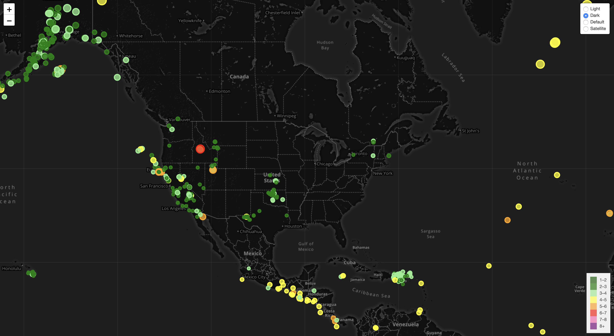

# Earthquake Data Visualization in Leaflet #

This JavaScript project provides an interactive visualization of various earthquakes around the world using data fetched from the US Geological Survey's API. [https://earthquake.usgs.gov/](https://earthquake.usgs.gov/)

## Default view with tooltip ##

## Dark theme with layer control ##

